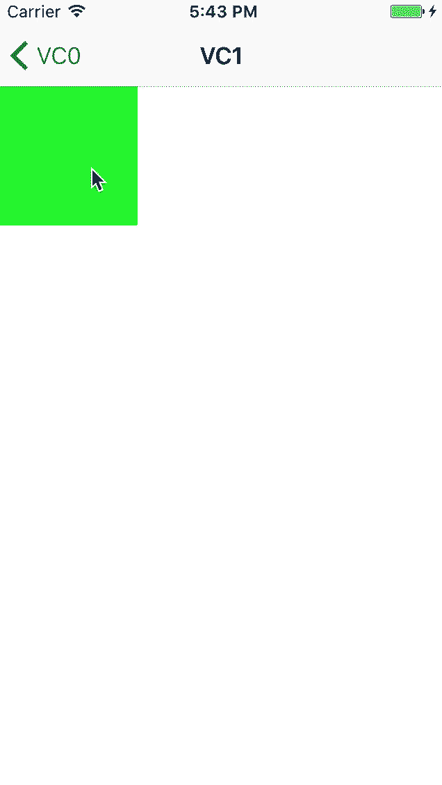

UINavigationController+YHPopGesture
======================

A pop gesture in viewcontroller even if there is a horizontal scrollview.


Installation
------------

Use [CocoaPods](http://cocoapods.org).

```ruby
pod 'UINavigationController+YHPopGesture'
```


Usage
-----

```
You don't have to do anything，AOP have already done it for you.
```



License
-------

UINavigationController+YHPopGesture is under MIT license. See the [LICENSE](LICENSE) file for more information.
